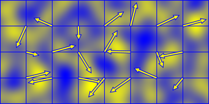
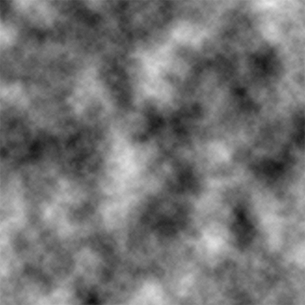

# Procedural World Generation
#### Authors: Sidney Wijngaarde and Pat Xu
#### [Presentation](https://docs.google.com/presentation/d/15x-g8li7KDZ4iqEUCILEOowCqIB52Eww9zLpJswj4Xs/edit?usp=sharing)

## Techniques
Overview of major components and our approach.

### [Three.js](https://threejs.org/)
- framework for interfacing with WebGL
- simplifies camera control, rendering, texturing, mesh generation

### Land
- vertex mesh with displacement via fBm Perlin noise

  
  

### Water Generation
- vertex mesh with displacement via Worley noise

  
  

## Inspiration
Some of the images that inspired this project.

  
  

  
  

## Future Work
- WebGL vertex and fragment shader for water reflection

  

- L-system support for vegetation

  
  
